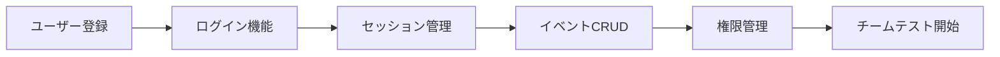

# チームテスト開始前の準備リスト 🎯

## 現在の実装状況 ✅

### 完了済み
- ✅ カレンダー表示
- ✅ 複数日イベント対応
- ✅ モックデータでのデモ
- ✅ パフォーマンス最適化
- ✅ A/Bテスト機能

### 未実装（テスト前に必要）❌
- ❌ ユーザー登録・ログイン
- ❌ データベース接続
- ❌ 実データの永続化
- ❌ 権限管理システム
- ❌ API実装

## 優先順位付き実装計画 📋

## Phase 1: 最小限のテスト環境（1-2日）

### 1. 簡易ユーザー登録・ログイン
```typescript
// 最小限の実装例
// app/api/auth/register/route.ts
export async function POST(request: Request) {
  const { email, password, name } = await request.json();
  
  // とりあえずローカルストレージかJSONファイルに保存
  const users = JSON.parse(fs.readFileSync('users.json', 'utf-8'));
  users.push({
    id: crypto.randomUUID(),
    email,
    name,
    password: hashPassword(password), // bcrypt使用
    role: 'worker',
    createdAt: new Date()
  });
  fs.writeFileSync('users.json', JSON.stringify(users));
  
  return NextResponse.json({ success: true });
}
```

### 2. 簡易データ永続化
```typescript
// JSONファイルベースの暫定実装
class SimpleDB {
  private dataFile = 'data/events.json';
  
  async getEvents(): Promise<Event[]> {
    const data = fs.readFileSync(this.dataFile, 'utf-8');
    return JSON.parse(data);
  }
  
  async saveEvent(event: Event): Promise<void> {
    const events = await this.getEvents();
    events.push(event);
    fs.writeFileSync(this.dataFile, JSON.stringify(events));
  }
}
```

### 3. 基本的な認証ガード
```typescript
// middleware.ts
export function middleware(request: NextRequest) {
  const token = request.cookies.get('auth-token');
  
  if (!token && !request.nextUrl.pathname.startsWith('/login')) {
    return NextResponse.redirect(new URL('/login', request.url));
  }
}
```

## Phase 2: チームテスト可能レベル（3-5日）

### 必須機能チェックリスト
- [ ] ユーザー登録フォーム
- [ ] ログイン/ログアウト
- [ ] イベント作成・編集・削除
- [ ] ユーザーごとのデータ分離
- [ ] 基本的な権限チェック

### 実装順序


## Phase 3: 本格運用準備（1週間）

### データベース接続
```bash
# PostgreSQL or MySQL
npm install prisma @prisma/client
npx prisma init
npx prisma migrate dev
```

### 環境別設定
```env
# .env.test (テストチーム用)
DATABASE_URL=postgresql://test_db
NEXTAUTH_URL=https://test.your-domain.com
NEXTAUTH_SECRET=test-secret

# .env.production (本番用)
DATABASE_URL=postgresql://prod_db
NEXTAUTH_URL=https://your-domain.com
NEXTAUTH_SECRET=production-secret
```

## クイックスタート（暫定版）🚀

### Option A: ローカルストレージのみ（最速）
```typescript
// 1日で実装可能
// lib/auth-simple.ts
export function simpleAuth() {
  const users = localStorage.getItem('users') || '[]';
  const currentUser = localStorage.getItem('currentUser');
  
  return {
    register: (userData) => {
      const userList = JSON.parse(users);
      userList.push(userData);
      localStorage.setItem('users', JSON.stringify(userList));
    },
    login: (email, password) => {
      const userList = JSON.parse(users);
      const user = userList.find(u => 
        u.email === email && u.password === password
      );
      if (user) {
        localStorage.setItem('currentUser', JSON.stringify(user));
        return user;
      }
      return null;
    },
    logout: () => {
      localStorage.removeItem('currentUser');
    }
  };
}
```

### Option B: Supabase（推奨、2-3日）
```bash
# Supabaseで簡単実装
npm install @supabase/supabase-js

# 環境変数設定
NEXT_PUBLIC_SUPABASE_URL=your-url
NEXT_PUBLIC_SUPABASE_ANON_KEY=your-key
```

```typescript
// lib/supabase.ts
import { createClient } from '@supabase/supabase-js'

export const supabase = createClient(
  process.env.NEXT_PUBLIC_SUPABASE_URL!,
  process.env.NEXT_PUBLIC_SUPABASE_ANON_KEY!
)

// 使用例
const { data, error } = await supabase.auth.signUp({
  email: 'test@example.com',
  password: 'password'
})
```

## テスト開始チェックリスト ✅

### 最小要件（必須）
- [ ] 5人分のテストアカウント作成
- [ ] ログイン・ログアウト動作確認
- [ ] データが保存される（リロードしても消えない）
- [ ] 各ユーザーのデータが分離されている
- [ ] 基本的なエラーハンドリング

### 推奨要件
- [ ] パスワードリセット機能
- [ ] メール通知（最低限コンソールログ）
- [ ] 簡単な使い方ガイド
- [ ] フィードバック収集フォーム
- [ ] 基本的なアクセスログ

## 5人チーム用の暫定アカウント

```json
// test-accounts.json
[
  {
    "email": "admin@test.com",
    "password": "Admin123!",
    "role": "admin",
    "name": "管理者"
  },
  {
    "email": "manager1@test.com", 
    "password": "Manager123!",
    "role": "manager",
    "name": "マネージャー1"
  },
  {
    "email": "worker1@test.com",
    "password": "Worker123!",
    "role": "worker",
    "name": "作業者1"
  },
  {
    "email": "worker2@test.com",
    "password": "Worker123!",
    "role": "worker",
    "name": "作業者2"
  },
  {
    "email": "viewer@test.com",
    "password": "Viewer123!",
    "role": "viewer",
    "name": "閲覧者"
  }
]
```

## 緊急実装スケジュール 📅

### 今すぐ始める場合
- **Day 1**: ローカルストレージ版の実装（4時間）
- **Day 2**: 基本的なCRUD機能（6時間）
- **Day 3**: テスト・修正（2時間）
- **合計**: 約12時間の作業

### しっかり作る場合
- **Day 1-2**: Supabase設定・認証実装
- **Day 3-4**: データモデル・API実装
- **Day 5**: テスト・デプロイ
- **合計**: 約40時間の作業

## 結論 💡

### すぐテスト開始したい場合
→ **ローカルストレージ版**を1日で実装

### 本格的にテストしたい場合
→ **Supabase版**を3日で実装

### 現実的な選択肢
**Supabase**を使えば、認証・DB・リアルタイム同期が簡単に実装できます。
3日あれば5人でテスト可能な環境が整います！