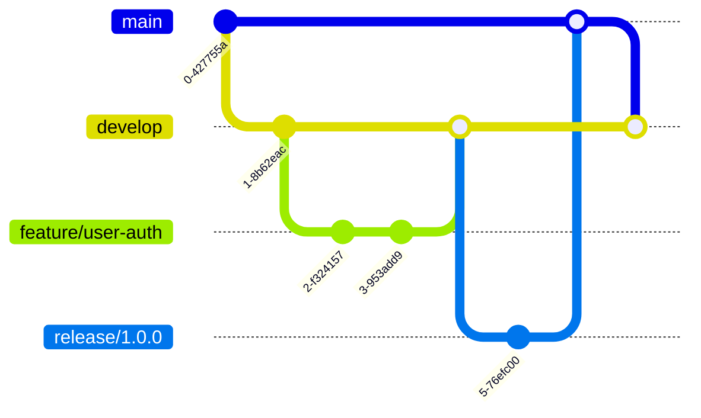

# 社内5人チーム向けセットアップガイド 👥

## 想定環境
- 開発者: 5名
- ユーザー数: 50-200名（社内利用）
- 環境: 開発/ステージング/本番

## 1. 開発環境の統一 🛠️

### Docker Compose設定
```yaml
# docker-compose.yml
version: '3.8'
services:
  app:
    build: .
    ports:
      - "3000:3000"
    environment:
      - NODE_ENV=development
      - DATABASE_URL=postgresql://user:pass@db:5432/scheduler
    volumes:
      - .:/app
      - /app/node_modules
  
  db:
    image: postgres:14
    environment:
      POSTGRES_DB: scheduler
      POSTGRES_USER: user
      POSTGRES_PASSWORD: pass
    volumes:
      - postgres_data:/var/lib/postgresql/data
    ports:
      - "5432:5432"

volumes:
  postgres_data:
```

### 環境変数管理
```bash
# .env.local (開発用)
DATABASE_URL=postgresql://localhost:5432/scheduler_dev
REDIS_URL=redis://localhost:6379
JWT_SECRET=dev-secret-key-change-in-production

# .env.staging
DATABASE_URL=postgresql://staging-db:5432/scheduler
REDIS_URL=redis://staging-redis:6379

# .env.production
DATABASE_URL=${AWS_RDS_URL}  # GitHub Secretsから
REDIS_URL=${AWS_ELASTICACHE_URL}
```

## 2. Git ブランチ戦略 🌳



### ブランチルール
- `main` - 本番環境（保護）
- `develop` - 開発環境
- `feature/*` - 機能開発
- `hotfix/*` - 緊急修正

### プルリクエストルール
```yaml
# .github/CODEOWNERS
# デフォルトレビュアー
* @team-lead @senior-dev

# フロントエンド
/components/ @frontend-team
/app/ @frontend-team

# バックエンド
/api/ @backend-team
/lib/ @backend-team

# インフラ
/infrastructure/ @devops-team
/.github/ @devops-team
```

## 3. CI/CD パイプライン 🚀

### GitHub Actions設定
```yaml
# .github/workflows/main.yml
name: CI/CD Pipeline

on:
  push:
    branches: [main, develop]
  pull_request:
    branches: [main, develop]

jobs:
  test:
    runs-on: ubuntu-latest
    steps:
      - uses: actions/checkout@v3
      
      - name: Setup Node.js
        uses: actions/setup-node@v3
        with:
          node-version: '18'
          cache: 'npm'
      
      - name: Install dependencies
        run: npm ci
      
      - name: Run tests
        run: npm test
      
      - name: Run linting
        run: npm run lint
      
      - name: Type check
        run: npm run type-check
      
      - name: Build
        run: npm run build

  deploy-staging:
    needs: test
    if: github.ref == 'refs/heads/develop'
    runs-on: ubuntu-latest
    steps:
      - name: Deploy to Staging
        run: |
          echo "Deploying to staging..."
          # Vercel or AWS deployment

  deploy-production:
    needs: test
    if: github.ref == 'refs/heads/main'
    runs-on: ubuntu-latest
    steps:
      - name: Deploy to Production
        run: |
          echo "Deploying to production..."
          # Production deployment
```

## 4. 社内専用機能 🏢

### LDAP/AD認証統合
```typescript
// lib/auth/ldap.ts
import ldap from 'ldapjs';

export async function authenticateWithLDAP(
  username: string, 
  password: string
): Promise<User | null> {
  const client = ldap.createClient({
    url: process.env.LDAP_URL!
  });

  return new Promise((resolve, reject) => {
    client.bind(
      `uid=${username},${process.env.LDAP_BASE_DN}`,
      password,
      (err) => {
        if (err) {
          resolve(null);
        } else {
          // ユーザー情報取得
          resolve(getUserFromLDAP(username));
        }
      }
    );
  });
}
```

### Slack通知統合
```typescript
// lib/notifications/slack.ts
export async function sendSlackNotification(
  channel: string,
  message: string,
  event?: Event
) {
  const webhook = process.env.SLACK_WEBHOOK_URL;
  
  await fetch(webhook!, {
    method: 'POST',
    headers: { 'Content-Type': 'application/json' },
    body: JSON.stringify({
      channel,
      text: message,
      attachments: event ? [{
        color: 'good',
        fields: [
          { title: '予定', value: event.title, short: true },
          { title: '日時', value: event.date, short: true },
          { title: '担当', value: event.workerName, short: true }
        ]
      }] : []
    })
  });
}
```

### 社内カレンダー連携
```typescript
// lib/calendar/outlook.ts
import { Client } from '@microsoft/microsoft-graph-client';

export async function syncWithOutlook(event: Event) {
  const client = Client.init({
    authProvider: (done) => {
      done(null, process.env.OUTLOOK_TOKEN);
    }
  });

  await client.api('/me/events').post({
    subject: event.title,
    start: {
      dateTime: event.startAt,
      timeZone: 'Asia/Tokyo'
    },
    end: {
      dateTime: event.endAt,
      timeZone: 'Asia/Tokyo'
    },
    location: {
      displayName: event.address
    }
  });
}
```

## 5. モニタリング・ログ 📊

### Datadog設定
```typescript
// lib/monitoring/datadog.ts
import { StatsD } from 'node-dogstatsd';

const dogstatsd = new StatsD();

export function trackMetric(
  metric: string, 
  value: number, 
  tags?: string[]
) {
  dogstatsd.gauge(metric, value, tags);
}

// 使用例
trackMetric('api.response_time', responseTime, [
  `endpoint:${endpoint}`,
  `user:${userId}`
]);
```

### エラー通知設定
```javascript
// Sentryの場合
Sentry.init({
  dsn: process.env.SENTRY_DSN,
  environment: process.env.NODE_ENV,
  integrations: [
    new Sentry.Integrations.Http({ tracing: true }),
  ],
  tracesSampleRate: 0.1, // 10%サンプリング
});
```

## 6. データベース管理 💾

### マイグレーション戦略
```bash
# Prismaの場合
npx prisma migrate dev --name add_user_table
npx prisma migrate deploy  # 本番環境

# バックアップスクリプト
#!/bin/bash
# scripts/backup.sh
DATE=$(date +%Y%m%d_%H%M%S)
pg_dump $DATABASE_URL > backups/backup_$DATE.sql
aws s3 cp backups/backup_$DATE.sql s3://your-backup-bucket/
```

### シードデータ
```typescript
// prisma/seed.ts
const seedData = {
  users: [
    { email: 'admin@company.com', role: 'ADMIN' },
    { email: 'manager@company.com', role: 'MANAGER' },
  ],
  departments: [
    { name: '営業部' },
    { name: '技術部' },
    { name: '管理部' },
  ]
};

async function seed() {
  for (const user of seedData.users) {
    await prisma.user.create({ data: user });
  }
}
```

## 7. セキュリティ設定 🔒

### IP制限（社内のみアクセス）
```typescript
// middleware.ts
export function middleware(request: NextRequest) {
  const ip = request.ip || request.headers.get('x-forwarded-for');
  const allowedIPs = process.env.ALLOWED_IPS?.split(',') || [];
  
  if (process.env.NODE_ENV === 'production' && 
      !allowedIPs.includes(ip!)) {
    return new Response('Forbidden', { status: 403 });
  }
}
```

### VPN設定
```yaml
# AWS Client VPN設定例
ClientVpnEndpoint:
  Type: AWS::EC2::ClientVpnEndpoint
  Properties:
    AuthenticationOptions:
      - Type: directory-service-authentication
        ActiveDirectory:
          DirectoryId: !Ref DirectoryService
    ClientCidrBlock: 10.0.0.0/16
    ServerCertificateArn: !Ref Certificate
```

## 8. パフォーマンステスト 🏃

### 負荷テストスクリプト
```javascript
// tests/load/k6-test.js
import http from 'k6/http';
import { check, sleep } from 'k6';

export let options = {
  stages: [
    { duration: '2m', target: 50 },  // 50ユーザーまで増加
    { duration: '5m', target: 50 },  // 50ユーザーで維持
    { duration: '2m', target: 0 },   // 0まで減少
  ],
};

export default function() {
  let response = http.get('http://localhost:3000/api/events');
  check(response, {
    'status is 200': (r) => r.status === 200,
    'response time < 500ms': (r) => r.timings.duration < 500,
  });
  sleep(1);
}
```

## 9. ドキュメント管理 📚

### API仕様書自動生成
```typescript
// Swagger設定
import swaggerJsdoc from 'swagger-jsdoc';

const options = {
  definition: {
    openapi: '3.0.0',
    info: {
      title: '空調スケジューラーAPI',
      version: '1.0.0',
    },
  },
  apis: ['./app/api/**/*.ts'],
};

export const specs = swaggerJsdoc(options);
```

### READMEテンプレート
```markdown
# 空調スケジューラー

## セットアップ
1. `npm install`
2. `.env.local`を作成
3. `npm run dev`

## 開発ルール
- PRは必ず2人以上のレビュー必須
- テストカバレッジ80%以上
- コミットメッセージは日本語OK

## トラブルシューティング
- DB接続エラー: VPN接続を確認
- ビルドエラー: `npm run clean`を実行
```

## 10. コスト見積もり（5人チーム）💰

### 開発環境（月額）
- GitHub Team: $20 (5人 × $4)
- Vercel Pro: $20
- Datadog: $75 (5ホスト)
- **合計: 約$115/月**

### 本番環境（AWS、200ユーザー想定）
- EC2 (t3.medium): $30
- RDS (t3.small): $25  
- ElastiCache: $15
- S3 + CloudFront: $10
- **合計: 約$80/月**

### 総計
**約$195/月（約3万円）**

## チェックリスト ✅

### 初期セットアップ
- [ ] Docker環境構築
- [ ] Git ブランチルール設定
- [ ] CI/CD パイプライン設定
- [ ] Slack通知設定
- [ ] VPN設定

### 開発開始前
- [ ] コーディング規約策定
- [ ] レビュープロセス確立
- [ ] テスト方針決定
- [ ] ドキュメント体制
- [ ] バックアップ設定

### 運用開始前
- [ ] 監視ダッシュボード
- [ ] アラート設定
- [ ] 障害対応フロー
- [ ] 定期メンテナンス計画
- [ ] コスト監視設定